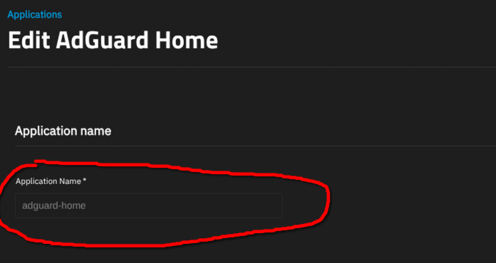

# What is Traefik?

Traefik is an [open-source](https://github.com/traefik/traefik) Application Proxy and the core of the Traefik Hub Runtime Platform.

If you start with Traefik for service discovery and routing, you can seamlessly add [API management](https://traefik.io/solutions/api-management/), [API gateway](https://traefik.io/solutions/api-gateway/), [AI gateway](https://traefik.io/solutions/ai-gateway/), and [API mocking](https://traefik.io/solutions/api-mocking/) capabilities as needed.

With 3.3 billion downloads and over 55k stars on GitHub, Traefik is used globally across hybrid cloud, multi-cloud, on prem, and bare metal environments running Kubernetes, Docker Swarm, AWS, [the list goes on](https://doc.traefik.io/traefik/reference/install-configuration/providers/overview/).

Here’s how it works—Traefik receives requests on behalf of your system, identifies which components are responsible for handling them, and routes them securely. It automatically discovers the right configuration for your services by inspecting your infrastructure to identify relevant information and which service serves which request.

Because everything happens automatically, in real time (no restarts, no connection interruptions), you can focus on developing and deploying new features to your system, instead of configuring and maintaining its working state.

## Setting up Traefik:

Will write this when I can screenshot the questions

## Connecting your Apps:

To connect your existing app(s) to Traefik for proxying. Add the following labels to your app(s)

### Required labels:

| Key:                                 | Value:                  |
| ------------------------------------ | ----------------------- |
| `traefik.enable`                   | `true`                |
| `traefik.docker.network`           | `ix-$APPNAME_default` |
| `traefik.http.routers.$MYAPP.rule` | ``Host(`\$APPDOMAIN`)`` |

`$MYAPP` is to be replaced with your App name. Every app specifies it's own router and it is important that the names **do not** overlap with others in order to prevent confusion and potential errors

`$APPNAME` is to be replaced with the name you gave your app (see image below). In this case this would result to `ix-adguard-home_default`

`\$APPDOMAIN` is to be replaced with the desired domain for your app. In the case of adguard, this would be either `adguard.mydomain.com` or `mydomain.com/adguard`

### HTTP Specific:

Labels required for proxying trough http. This means that the way you can access your app afterwards will be `http://myapp.mydomain.com` or `http://mydomain.com/myapp`

| Key:                                                            | Value:                                                                                                                                       |
| --------------------------------------------------------------- | -------------------------------------------------------------------------------------------------------------------------------------------- |
| `traefik.http.routers.$MYAPP.entrypoints`                     | `web`                                                                                                                                      |
| Optional: `traefik.http.routers.$MYAPP.tls.certresolver` | HTTP Challenge: `truenashttpresolver` TLS Challenge: `truenastlsresolver` DNS Challenge: `truenasdnsresolver` |

`$MYAPP` is to be replaced with your App name. Every app specifies it's own router and it is important that the names **do not** overlap with others in order to prevent confusion and potential errors

### HTTPS Specific:

Labels required for proxying trough https. This means that the way you can access your app afterwards will be `https://myapp.mydomain.com` or `https://mydomain.com/myapp`

| Key:                                             | Value:                                                                                     |
| ------------------------------------------------ | ------------------------------------------------------------------------------------------ |
| `traefik.http.routers.$MYAPP.entrypoints`      | `websecure`                                                                              |
| `traefik.http.routers.$MYAPP.tls.certresolver` | TLS Challenge: `truenastlsresolver` DNS Challenge: `truenasdnsresolver` |

`$MYAPP` is to be replaced with your App name. Every app specifies it's own router and it is important that the names **do not** overlap with others in order to prevent confusion and potential errors

### Advanced scenarios:

#### Specify Port number:

Traefik by default graps the first exposed port from the container. This is not always the port for the webui. So how do we specify?
In the table below you will find the label needed to specify the webui port

| Key:                                                      | Value:           |
| --------------------------------------------------------- | ---------------- |
| `traefik.http.services.$MYAPP.loadbalancer.server.port` | `\$PORTNUMBER` |

`$MYAPP` is to be replaced with your App name. Every app specifies it's own service and it is important that the names **do not** overlap with others in order to prevent confusion and potential errors. When a service is not specified, one will be generated by Traefik and this will be seperate per app.

`\$PORTNUMBER` is to be replaced with the port for the WebUI.

#### WebUI already uses HTTPS:

Some Web UI's already use https and a self signed certificate (or a signed one if you've already set that up).
Unfortunately Traefik defaults to redirecting to HTTP, this may result in an error when proxying.
To prevent this you can specify the scheme used for proxying.

| Key:                                                        | Value:    |
| ----------------------------------------------------------- | --------- |
| `traefik.http.services.$MYAPP.loadbalancer.server.scheme` | `https` |

`$MYAPP` is to be replaced with your App name. Every app specifies it's own service and it is important that the names **do not** overlap with others in order to prevent confusion and potential errors. When a service is not specified, one will be generated by Traefik and this will be seperate per app.

#### App has (or needs) host network enabled:

When using the host network, the Webui URL needs to be specified. This is done as shown below.

| Key:                                                     | Value:                                                                                               |
| -------------------------------------------------------- | ---------------------------------------------------------------------------------------------------- |
| `traefik.http.services.$MYAPP.loadbalancer.server.url` | Example: `https://10.0.10.2:30051` With Vars: `\$SCHEME://$IPADDRESS:$PORTNUMBER` |

`$MYAPP` is to be replaced with your App name. Every app specifies it's own service and it is important that the names **do not** overlap with others in order to prevent confusion and potential errors. When a service is not specified, one will be generated by Traefik and this will be seperate per app.

`\$SCHEME` is to be replaced with either http or https, depending on what your webUI uses.

`$IPADDRESS` is to be replaced with the IP address of your Truenas Server. When using host network, this is where your app will be accessible.

`$PORTNUMBER` is to be replaced with the port your webui uses.

#### Multiple domains for one app:

To redirect multiple domains to one app, you can use the OR `||` Operator. For an app like Home Assistant, you may want to redirect both `homeassistant.mydomain.com` and `ha.mydomain.com` to home assistant. In the table below you can see how this is used. You can add more domains as needed.

| Key:                                 | Value:                                                            |
| ------------------------------------ | ----------------------------------------------------------------- |
| `traefik.http.routers.$MYAPP.rule` | ``Host(`homeassistant.mydomain.com`) \|\| Host(`ha.mydomain.com`)`` |

`$MYAPP` is to be replaced with your App name. Every app specifies it's own router and it is important that the names **do not** overlap with others in order to prevent confusion and potential errors

#### Restricting access:

You may feel that some apps should not be publicly accessible. To restrict access you can use the AND `&&` operator and the `ClientIP()` Tag. This allows for restricting access to an ip address or subnet. The following examples will be IPV4 only.

| Key:                                                              | Value:                                                       |
| ----------------------------------------------------------------- | ------------------------------------------------------------ |
| Restrict to IP address: `traefik.http.routers.$MYAPP.rule` | ``Host(`myapp.mydomain.com`) && ClientIP(`10.0.0.200`)``     |
| Restrict to subnet: `traefik.http.routers.$MYAPP.rule`     | ``Host(`myapp.mydomain.com`) && ClientIP(`192.168.1.0/24`)`` |

`$MYAPP` is to be replaced with your App name. Every app specifies it's own router and it is important that the names **do not** overlap with others in order to prevent confusion and potential errors

#### Multiple domains & Access restriction:

Restricting access to multiple domains is a little more complex. I have found that it processes AND `&&` over OR `||` .
This means that ``Host(`homeassistant.mydomain.com`) || Host(`ha.mydomain.com`) && ClientIP(`10.0.0.156`)`` will only restrict access to `ha.mydomain.com`, while `homeassistant.mydomain.com` remains publicly accessible. To restrict both you have to use ``&& ClientIP(`10.0.0.156`)`` with both Hosts. This would look as following:
``Host(`homeassistant.mydomain.com`) && ClientIP(`10.0.0.156`) || Host(`ha.mydomain.com`) && ClientIP(`10.0.0.156`)``
